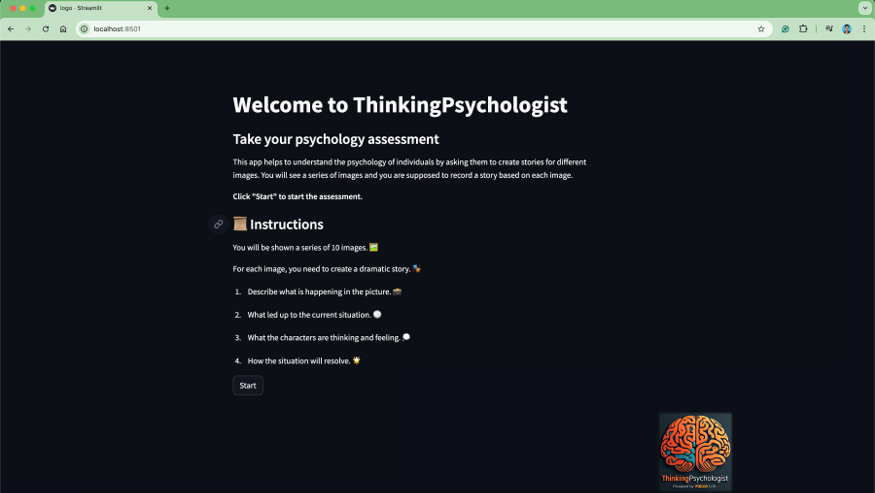
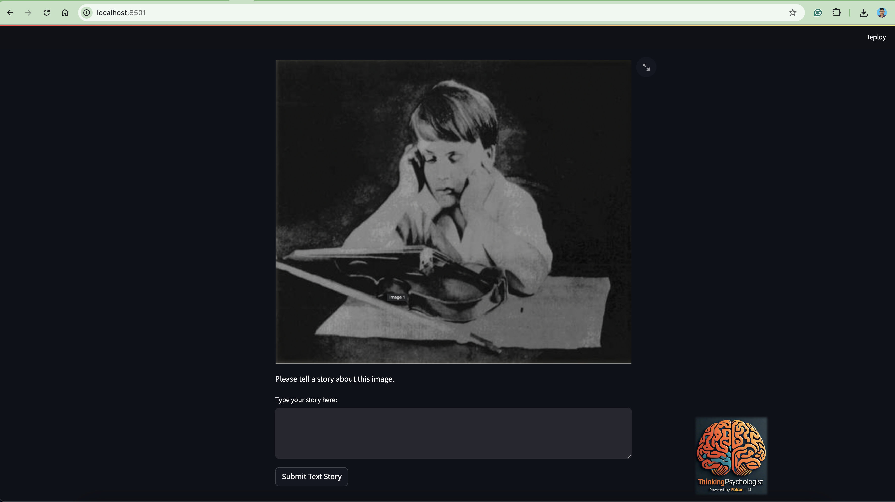
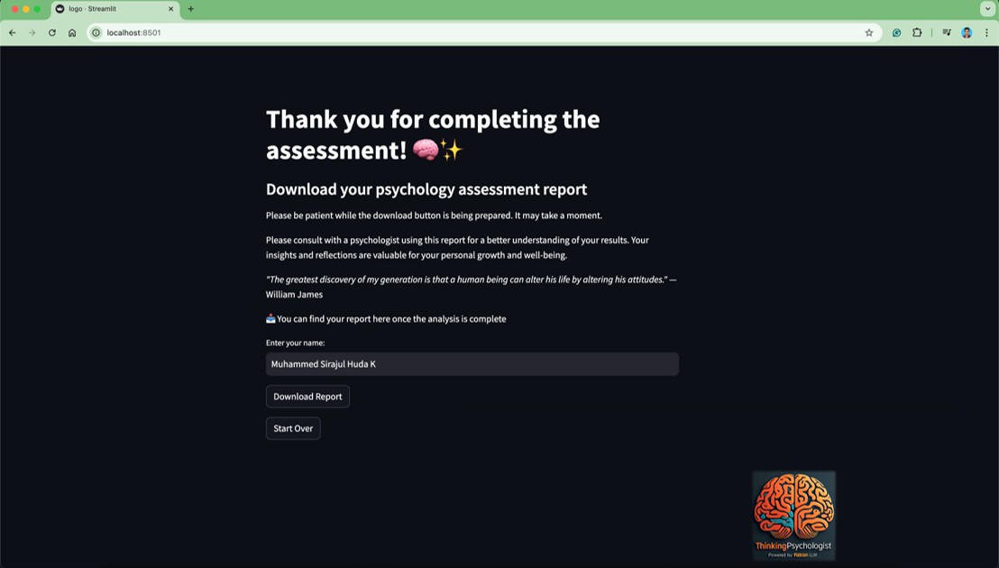

# 🧠 ThinkingPsychologist

Welcome to ThinkingPsychologist! This innovative application, powered by Falcon LLM, serves as a virtual psychologist, offering users a unique opportunity to explore their psychology through storytelling.

By analyzing narratives created in response to a series of images, ThinkingPsychologist provides insights into personality traits, emotional states, and other psychological aspects.

🌐 **Access the Deployed App**  
You can access the deployed app at the following link:

[ThinkingPsychologist App](https://thinkingpsychologist-dpfclbx99uuzamqfmejxhz.streamlit.app/)

🚀 **Features**

🖼️ **Image-Based Storytelling**  
Users are presented with a series of images and are invited to type a story based on each image. This approach helps reveal underlying thoughts, feelings, and perceptions.

📝 **Text Input for Storytelling**  
The app allows users to type their stories directly into a text box for each image, eliminating the need for audio recording.

🤖 **AI-Driven Analysis**  
Utilizing the powerful Falcon LLM, the application generates a detailed psychology assessment report. This includes evaluations of personality traits, emotional states, key observations, and personalized recommendations.

📄 **PDF Report Generation**  
Users receive a personalized PDF report summarizing their psychological analysis, featuring actionable insights and recommendations.

📋 **How It Works**

1. **Introduction**  
   Users begin by reading the introductory page, which provides an overview of the process and instructions.

2. **Storytelling Phase**  
   Users view a series of images, one at a time, and type a story for each image.

3. **Analysis Phase**  
   The app aggregates the text stories and uses Falcon LLM to analyze them, generating a comprehensive psychology assessment.

4. **Report Generation**  
   A detailed PDF report is created and made available for download, including an overall assessment, detailed personality traits, and recommendations for personal growth.


## 🛠️ **Installation**

1. **Clone the repository:**

    ```bash
    git clone https://github.com/MuhammedSirajulHudaK/ThinkingPsychologist.git
    ```

2. **Navigate into the project directory:**

    ```bash
    cd ThinkingPsychologist
    ```

3. **Checkout the text-story-input branch:**
    ```bash
    git checkout text-story-input
    ```
4. **Install the required packages:**

    ```bash
    pip install -r requirements.txt
    ```

## 🚀 **Running the App**

To run the Streamlit app, use the following command:

```bash
streamlit run app.py
 ```
## Home Page



## Storytelling Page



## Report Download Page



